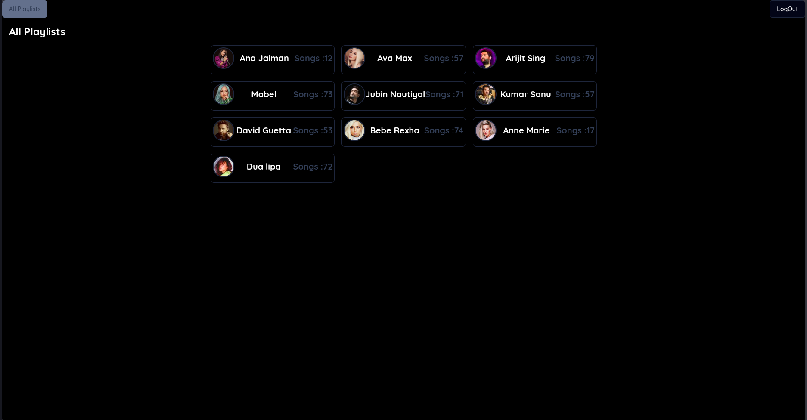
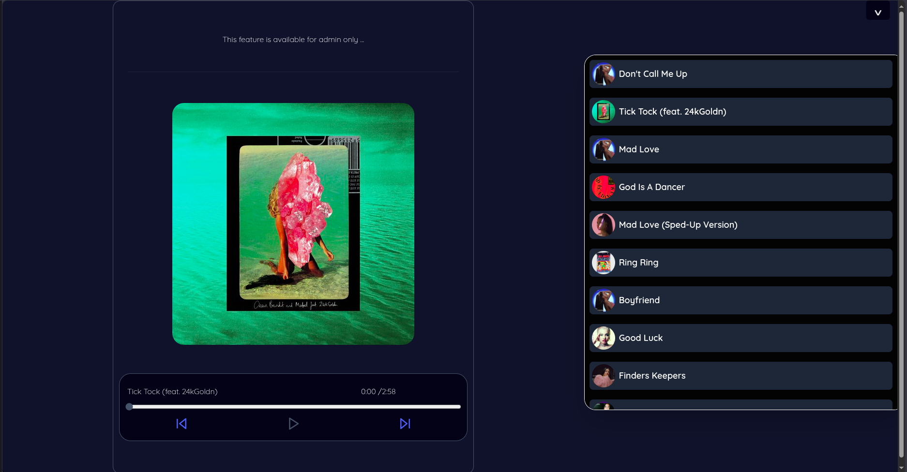
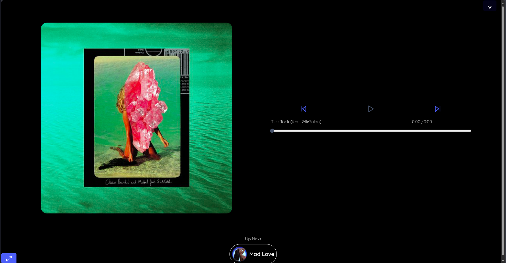
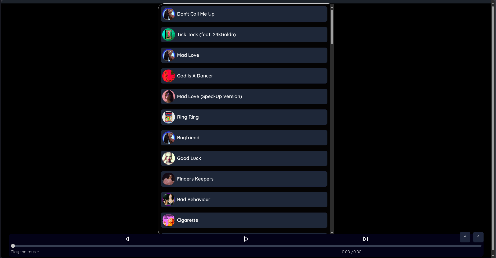

# Music Hub (Next.js + Appwrite)

A modern, themeable music player web app with playlists, user accounts, and media session controls.

- Live: <https://music-codershubinc.vercel.app>



Caption: Home page — title shows "Playlists" (or other section when switched).

## Features

- Playlists
  - View all playlists and your own (admin-gated for now)
  - Add/remove songs to user playlists
  - Search singer playlists when uploading
- Player
  - Inline and fullscreen players
  - Media Session integration (lock screen/keyboard media keys)
  - Next/Previous, seek, pause/play, queue handling
- Auth & Profiles
  - Appwrite-based auth
  - User preferences (avatars, created playlists)
  - Avatar upload/change with preview
- Theming & UI
  - Dark mode with `next-themes`
  - Tailwind CSS + Radix UI + shadcn-inspired components
  - AMP-friendly ad snippet support

## Tech Stack

- Framework: `Next.js 14`
- Language: `TypeScript`
- UI: `Tailwind CSS`, Radix UI primitives, Framer Motion
- State/Context: React Context (`AuthContext`)
- Backend: `Appwrite` (Auth, DB, Storage)
- Toasts: `react-hot-toast`

## Screenshots

These are under `.github/static` in this repo.


Caption: Home page — title shows "Playlists" (or other section when switched).



Caption: Music player (compact view) — play/pause, next/previous, seek.



Caption: Music player (full-screen view) with artwork and controls.



Caption: Playlist view — list of tracks with actions.

## Getting Started

1. Install dependencies

```zsh
bun install # or npm install / pnpm install / yarn
```

1. Configure environment variables

Create a `.env.local` in the project root with your Appwrite values. These are referenced in `src/conf/conf.ts`:

```env
NEXT_PUBLIC_APPWRITE_PROJECT_ID=...
NEXT_PUBLIC_APPWRITE_DATABASE_ID=...
NEXT_PUBLIC_APPWRITE_USER_CONFIG_COLLECTION_ID=...
NEXT_PUBLIC_APPWRITE_MUSIC_CONFIG_COLLECTION_ID=...
NEXT_PUBLIC_APPWRITE_MUSIC_PLAYLIST_COLLECTION_ID=...
NEXT_PUBLIC_APPWRITE_MUSIC_PLAYLIST_BY_USER_COLLECTION_ID=...
NEXT_PUBLIC_APPWRITE_MUSIC_BUCKET_ID=...
NEXT_PUBLIC_APPWRITE_AVATAR_BUCKET_ID=...
NEXT_PUBLIC_SECRET_KEY=...
NEXT_PUBLIC_APPWRITE_DEV_KEY=...
```

1. Run the dev server

```zsh
npm run dev
# or
pnpm dev
# or
yarn dev
# or
bun run dev
```

Open <http://localhost:3000>

## Scripts

- `dev`: start Next.js dev server
- `build`: build production bundle
- `start`: start production server
- `lint`: run Next.js ESLint

## Project Structure (high level)

- `src/app/*` routes, layouts, pages (Next.js App Router)
- `src/components/*` UI and feature components
- `src/context/AuthContext.tsx` auth state and user prefs
- `src/config/*` Appwrite SDK usage and DB configs
- `src/utils/*` helpers, media session, playback controllers
- `public/*` static assets

## Notes

- Admin-only sections: Some playlist management features are gated to users with `labels` containing `admin`.
- Media Session: If the browser doesn’t support Media Session API, player still works without media key bindings.

## Deployment

Deploy easily on Vercel (recommended). Ensure all `NEXT_PUBLIC_*` env vars are set in your deployment environment.

## License

MIT
